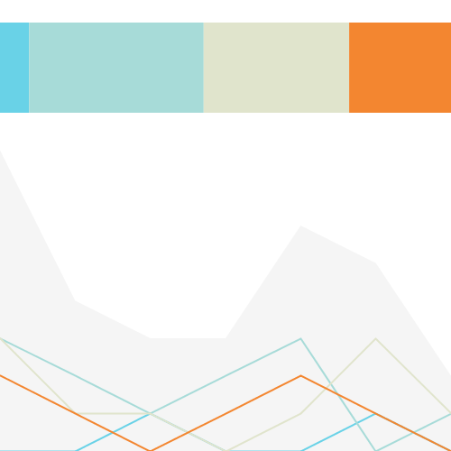

JSON file
=========

Loading structured data from a `.json` file.



[View source](F_json_file.pde)

Data
-----------

```json
[
  {
    "date": "3/5/2017",
    "early_morning": 0,
    "morning": 3,
    "afternoon": 3,
    "evening": 2,
    "total": 8
  },
  {
    "date": "3/6/2017",
    "early_morning": 0,
    "morning": 2,
    "afternoon": 1,
    "evening": 1,
    "total": 4
  },
  {
    "date": "3/7/2017",
    "early_morning": 1,
    "morning": 1,
    "afternoon": 1,
    "evening": 0,
    "total": 3
  },
  {
    "date": "3/8/2017",
    "early_morning": 0,
    "morning": 2,
    "afternoon": 0,
    "evening": 1,
    "total": 3
  },
  {
    "date": "3/9/2017",
    "early_morning": 0,
    "morning": 3,
    "afternoon": 1,
    "evening": 2,
    "total": 6
  },
  {
    "date": "3/10/2017",
    "early_morning": 1,
    "morning": 0,
    "afternoon": 3,
    "evening": 1,
    "total": 5
  },
  {
    "date": "3/11/2017",
    "early_morning": 0,
    "morning": 1,
    "afternoon": 1,
    "evening": 0,
    "total": 2
  }
]
```